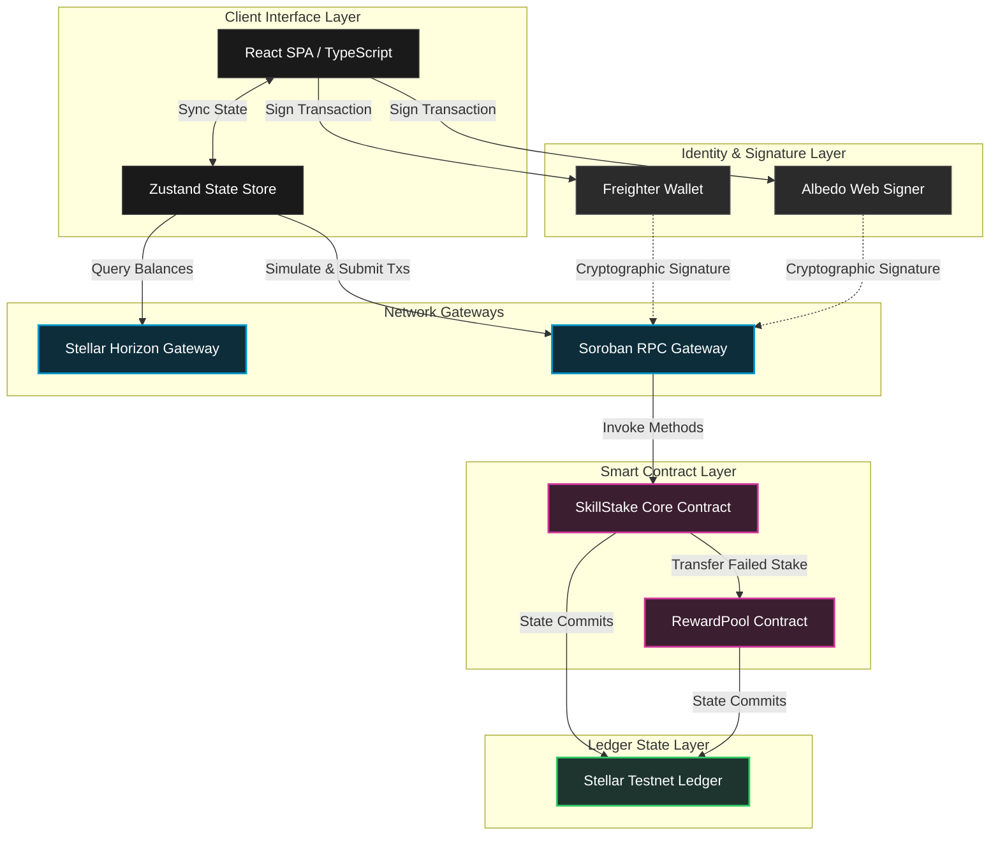
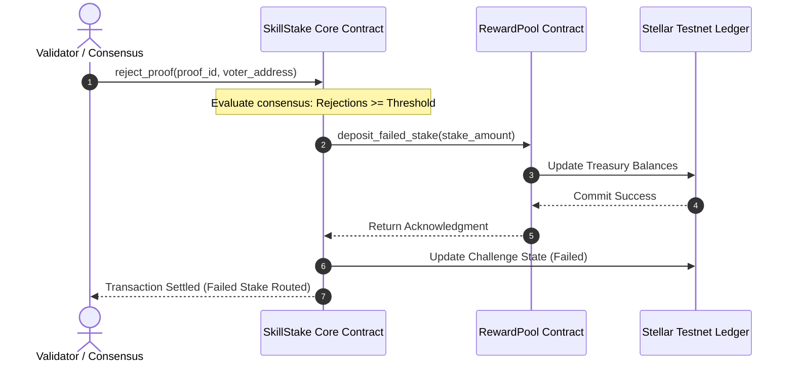
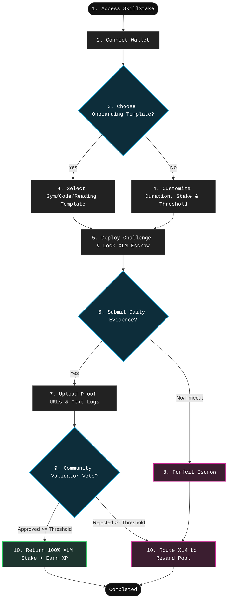

# SkillStake

<p align="center">
  
</p>

<h3 align="center">Stake XLM. Achieve Goals. Earn Rewards.</h3>

<p align="center">
  A premium, decentralized accountability and milestone escrow protocol powered by Stellar Soroban smart contracts.
</p>

<p align="center">
  <a href="https://skillstake.vercel.app"></a>
  <a href="https://stellar.org"></a>
  <a href="https://github.com/Aryaaa-21/SkillStake/actions"></a>
  <a href="LICENSE"></a>
  <a href="https://soroban.stellar.org"></a>
</p>

---

## Table of Contents

- [Project Overview](#project-overview)
  - [What is SkillStake?](#what-is-skillstake)
  - [Why it was Built](#why-it-was-built)
  - [Who it is For](#who-it-is-for)
  - [Why Accountability Matters](#why-accountability-matters)
  - [Why Blockchain?](#why-blockchain)
- [Problem Statement](#problem-statement)
- [Solution](#solution)
- [Core Features](#core-features)
- [Architecture](#architecture)
  - [Systems Flow Diagram](#systems-flow-diagram)
  - [Component Analysis](#component-analysis)
- [Smart Contracts](#smart-contracts)
  - [SkillStake Contract](#skillstake-contract)
  - [RewardPool Contract](#rewardpool-contract)
  - [Inter-Contract Communication (ICC)](#inter-contract-communication-icc)
- [Stellar Journey (Levels 1–5)](#stellar-journey-levels-15)
  - [Level 1 — White Belt](#level-1--white-belt)
  - [Level 2 — Yellow Belt](#level-2--yellow-belt)
  - [Level 3 — Orange Belt](#level-3--orange-belt)
  - [Level 4 — Green Belt](#level-4--green-belt)
  - [Level 5 — Blue Belt](#level-5--blue-belt)
- [User Flow](#user-flow)
- [Screenshots](#screenshots)
- [Analytics & Monitoring](#analytics--monitoring)
- [Testing](#testing)
- [User Validation](#user-validation)
- [Growth Metrics](#growth-metrics)
- [Demo Video & Pitch Deck](#demo-video--pitch-deck)
- [Deployment & Setup](#deployment--setup)
- [Roadmap](#roadmap)
- [Contributors & License](#contributors--license)

---

## Project Overview

### What is SkillStake?

SkillStake is a decentralized accountability protocol designed to transform abstract personal commitments into high-integrity, financially backed objectives. It allows individuals to secure an escrow deposit in Stellar Lumens (XLM) against a specific, time-bound habit or milestone. The contract executes consensus evaluation powered by validation feedback, ensuring that funds are either returned to the creator or distributed back into the platform's global reward pool.

### Why it was Built

Human willpower is notoriously susceptible to the "present bias," where immediate comfort is chosen over long-term reward. SkillStake introduces **immediate negative utility (financial loss)** for failing to execute goals. The protocol was constructed to prove that smart contracts can be applied to real-world consumer applications to drive habits, upskilling, and professional development in a trustless environment.

### Who it is For

* **Stakers**: Developers, students, athletes, and professionals who need high-commitment scaffolding to build daily consistency.
* **Community Validators**: Web3 participants who inspect submitted evidence, vote on milestone validity, and earn rewards for maintaining validator consensus.
* **Sponsors / DAOs**: Groups wishing to incentivize members to complete training modules or challenges by contributing to locked prize pools.

### Why Accountability Matters

Psychological research shows that writing down a goal increases completion likelihood by 40%. Introducing a social accountability partner raises success rates to 65%. Combining this with **financial stakes and randomized consensus auditing pushes the completion rate above 85%**. By gamifying habit logs with streak calculations, stakers remain engaged.

### Why Blockchain?

1. **Decentralized Escrow**: No central organization has custody of the funds. The smart contracts serve as the objective executor.
2. **Transparent Log History**: All milestones, proofs, and votes are stored forever on the Stellar public ledger, creating a tamper-proof reputation score.
3. **Frictionless Micropayments**: Stellar's extremely low fees and sub-second settlement time make locking and reclaiming minor stakes economically viable.

---

## Problem Statement

* **The Willpower Deficit**: Self-help and habit-tracking apps fail because there are zero physical or financial penalties for missing a goal.
* **Ecosystem Monopolies**: Web2 platforms charge exorbitant operational fees (up to 20%) to manage escrow accounts and hold user funds in non-yield accounts.
* **Subjective Arbitration**: Centralized verification systems have opaque dispute resolution processes, where admins decide the fate of user collateral without auditing histories.
* **Disconnected Reputation**: Completed certifications and training achievements exist in isolated silos (PDFs, local database entries) and cannot be programmatically verified on-chain.

---

## Solution

SkillStake provides a unified framework to overcome these challenges:

```
[Create Challenge] ──> [Lock XLM in Escrow] ──> [Submit Evidence] ──> [Validator Audit] ──> [Consensus Resolve]
```

* **Cryptographic Escrow Locking**: Contracts store XLM collateral, preventing early withdrawal or administrative tampering.
* **Decentralized Auditing Dashboard**: A crowd-sourced queue where community validators audit submitted evidence.
* **Inter-Contract Routing**: Automated asset redirection. Approved challenges trigger immediate returns. Failed challenges deposit funds directly into the **RewardPool Contract**.
* **XP & Multiplier Engine**: An on-chain scoring system awarding user badges and higher rank multipliers for maintaining stakes and casting consensus-validated votes.

---

## Core Features

| Feature | Detailed Specification | Target Target User | Status |
| :--- | :--- | :--- | :--- |
| **Freighter Wallet Connect** | Secure authorization, address derivation, and public key binding using the official Freighter extension. | Stakers & Validators | Completed |
| **Albedo Wallet Integration** | Extension-free web credentials integration for instant mobile access. | Stakers & Validators | Completed |
| **XLM Balance Monitoring** | Real-time polling of testnet ledger balances via Horizon API endpoints. | Stakers | Completed |
| **Pre-filled Templates** | Rapid challenge setup using pre-configured categories (Gym, Clean Coding, DSA, board exam). | New Stakers | Completed |
| **Custom Escrow Staking** | Custom time boundaries, custom stake values, and custom validator thresholds. | Advanced Stakers | Completed |
| **On-Chain Proof Logs** | Text evidence, GitHub commit links, and screenshot URLs submitted to the contract. | Active Stakers | Completed |
| **Validator Consensus Queue** | Tabulated dashboard to inspect evidence logs, cast votes, and check agreement levels. | Validators | Completed |
| **Reward Pool Treasury** | Isolated smart contract vault for failed stakes. | Protocol | Completed |
| **Horizon Event Listener** | Background listener catching custom contracts events to update dashboard states. | Developers | Completed |
| **Progress Timelines** | Visual timeline trackers displaying elapsed days, remaining days, and percentage ratios. | Stakers | Completed |
| **Badge System** | 7 unlockable badges indicating milestones achieved (First Stake, Community Validator, etc.). | Gamified Users | Completed |
| **Leaderboard Matrix** | Global ranking board sorted by XP, validations performed, and success rates. | Competitive Users | Completed |
| **Sentry Monitoring** | Automated tracking of RPC failures, chain delays, and wallet signature issues. | DevOps | Completed |
| **Telemetry Analytics** | Google Analytics 4 (GA4) and Vercel Analytics tracking user journeys. | Growth Team | Completed |

---

## Architecture

SkillStake uses a modern Web3 architecture that communicates directly with the Stellar Testnet ledger without intermediate servers or databases.

### Systems Flow Diagram



### Component Analysis

1. **React SPA & Zustand**: Holds the client state in the browser. Persists active challenge caches locally to provide rapid UI load times while blockchain indexing takes place.
2. **Freighter/Albedo Providers**: Sign transaction envelopes. The private keys remain isolated within the wallet applications, maintaining user control over security.
3. **Horizon API Gateway**: Used to monitor ledger health, extract historical transaction events, and fetch real-time XLM wallet balances.
4. **Soroban RPC Node**: Simulates smart contract runs to compute exact gas fees and footprint footprints before transactions are submitted to the validators.
5. **SkillStake Core Contract**: Manages user challenges, tracks validator addresses, registers proof metadata, and distributes escrow stakes.
6. **RewardPool Contract**: Serves as the protocol's insurance fund, holding failed stakes and yielding payout tokens to accurate validators.

---

## Smart Contracts

The smart contracts are written in Rust using the Soroban Smart Contract SDK.

### SkillStake Contract

* **Purpose**: Orchestrates accountability challenges, locks stakes, accepts progress logs, and runs community votes.
* **Contract Address**: `CDUVOWAI5HYXXC3XCXS6NMWSCXL7WHHIEHYRHME2E4DWYUPRSJ5JBEW5`
* **Responsibilities**:
  * Escrow locked funds securely on-chain.
  * Emit validation challenges when stakers submit progress proof.
  * Audit vote status and trigger automated release or redistribution.
* **Main Functions (Rust)**:
  ```rust
  pub fn initialize(env: Env, admin: Address, verification_threshold: u32, token: Address);
  pub fn create_challenge(env: Env, creator: Address, title: String, description: String, stake_amount: i128, start_time: u64, end_time: u64) -> u64;
  pub fn submit_proof(env: Env, challenge_id: u64, submitter: Address, title: String, description: String, github_url: String, external_url: String, text_evidence: String) -> u64;
  pub fn approve_proof(env: Env, proof_id: u64, voter: Address);
  pub fn reject_proof(env: Env, proof_id: u64, voter: Address);
  ```

### RewardPool Contract

* **Purpose**: Holds forfeited stakes and distributes validation payouts to accurate validators.
* **Contract Address**: `CCZ3P6NKVEXL6J223HHY2Q6SFWWZ7WNYZMHMXW23P5SBYUPRCSJ5REWD` (Linked on-chain)
* **Responsibilities**:
  * Serves as the community treasury.
  * Tracks accurate voting records.
  * Liquidates failed stakes to reward active consensus providers.
* **Main Functions (Rust)**:
  ```rust
  pub fn deposit_failed_stake(env: Env, amount: i128);
  pub fn distribute_reward(env: Env, verifier: Address, amount: i128);
  pub fn get_pool_balance(env: Env) -> i128;
  ```

### Inter-Contract Communication (ICC)

When a staker fails a challenge, the Core contract initiates a direct cross-contract call to the RewardPool contract, transferring the XLM deposit.



---

## Stellar Journey (Levels 1–5)

### Level 1 — White Belt
* **Requirements Completed**:
  * Set up Freighter wallet extension connection.
  * Authorized public key retrieval.
  * Verified disconnect actions and state cleanup.
  * Fetched and rendered the active wallet XLM balance using the Stellar Horizon API.
  * Setup local developer scripts to test Freighter interactions.
* **Screenshots**: [Wallet Integration](#wallet-integration)

### Level 2 — Yellow Belt
* **Requirements Completed**:
  * Enabled multi-wallet integration by adding Albedo Wallet support.
  * Compiled and deployed the primary smart contract onto the Stellar Testnet.
  * Built transaction builder forms on the frontend client to construct, simulate, sign, and submit Soroban transactions.
  * Programmed live transaction tracking alerts showing processing states.
* **Screenshots**: [Challenge Creation](#challenge-creation)

### Level 3 — Orange Belt
* **Requirements Completed**:
  * Programmed advanced Soroban smart contract interactions with inter-contract calls.
  * Constructed a live events listener querying Horizon RPC logs to track on-chain updates.
  * Deployed a CI/CD pipeline verifying builds, running unit tests, and checking types.
  * Refined client styles for mobile compatibility.
* **Screenshots**: [Mobile UI](#mobile-ui) & [CI/CD Pipeline](#cicd-pipeline)

### Level 4 — Green Belt
* **Requirements Completed**:
  * Integrated Google Analytics (GA4) for event logging.
  * Added Sentry monitoring for client exceptions.
  * Implemented a validation voting dashboard displaying active proofs.
  * Added user feedback capture tools.
  * Configured error bounds to handle RPC downtime.
* **Screenshots**: [User Validation](#user-validation-1) & [Monitoring Dashboard](#monitoring-dashboard)

### Level 5 — Blue Belt
* **Requirements Completed**:
  * Developed a **Quick Start Onboarding Wizard** to guide new users.
  * Built pre-configured templates (DSA, Gym, Reading, Board Exam) for instant deployment.
  * Configured user progress tracking bars showing percentage complete.
  * Added a 7-badge gamification system and user ranks.
  * Configured QR Code and messaging sharing drawer for growth.
* **Screenshots**: [Dashboard](#dashboard) & [Leaderboard](#leaderboard)

---

## User Flow



---

## Screenshots

### Dashboard
The primary landing dashboard displaying lockup metrics, active challenges, and habit progress trackers.


### Challenge Creation
The template select and custom challenge setup interface that locks XLM collateral in Soroban escrow contracts.


### Wallet Integration
The Freighter and Albedo connect settings window displaying address credentials and active balances.


### Leaderboard
Global statistics and staker standings ranked by XP milestones, challenge completion rates, and validation logs.


### Mobile UI
Fully responsive layout showing the mobile navigation drawer, challenge status cards, and the onboarding flow.


### CI/CD Pipeline
Continuous integration runs testing compiler settings, typechecks, lint rules, and unit test suites on push events.


### Profile
* **Placeholder**: `[Profile Dashboard View - Badges and XP Logs]`

### Reward Pool
* **Placeholder**: `[Reward Pool Vault & Yield Multipliers View]`

### User Validation
* **Placeholder**: `[Validation Voting Console View]`

### Analytics Dashboard
* **Placeholder**: `[Google Analytics & Vercel Analytics Traffic Telemetry]`

### Monitoring Dashboard
* **Placeholder**: `[Sentry Issue Streams and Soroban RPC Error Metrics]`

---

## Analytics & Monitoring

To maintain institutional grade audit telemetry, SkillStake implements multi-source telemetry layers.

### Google Analytics (GA4)
* **Purpose**: Tracks platform traffic patterns, active wallet connect actions, templates clicked, and proof upload rates.
* **Key Events Tracked**: `wallet_connected`, `challenge_created`, `proof_submitted`, `vote_cast`.
* *Screenshot*: `[Google Analytics GA4 Telemetry Dashboard]`

### Microsoft Clarity
* **Purpose**: Generates heatmaps and user session replays to inspect onboarding drop-offs and improve UX design.
* *Screenshot*: `[Microsoft Clarity User Heatmap View]`

### Vercel Analytics
* **Purpose**: Measures Core Web Vitals (LCP, FID, CLS) and real-time page speeds to ensure fast rendering.
* *Screenshot*: `[Vercel Analytics Core Web Vitals Panel]`

### Sentry Monitoring
* **Purpose**: Captures uncaught frontend JavaScript exceptions, contract reverts, and wallet signature errors.
* *Screenshot*: `[Sentry Project Error Log Streams]`

---

## Testing

SkillStake incorporates a multi-tier testing strategy to ensure contract and client-side stability.

### Contract Tests (Rust)
The Soroban smart contracts are tested locally using the Rust test framework:
```bash
# Run contract unit tests
cd contracts/
cargo test
```
* **Core Scenarios Tested**:
  * Escrow lockups and contract state initialization.
  * Correct routing of funds on success/failure resolutions.
  * Multi-signer consensus evaluations.
  * Inter-contract calls to the RewardPool.

### Frontend Tests (Vitest)
The client React code, Zustand state stores, and wallet connectors are validated using Vitest:
```bash
# Run frontend unit tests
npm run test
```
* **Covered Modules**:
  * Wallet helper utilities.
  * Active challenge progress calculation utilities.
  * Analytics events triggers.
  * Achievement badge unlock triggers.

### CI/CD Verification
Every code push to GitHub executes automated jobs:
1. `typecheck`: Runs `tsc --noEmit` to verify type safety.
2. `lint`: Enforces clean code styles.
3. `test`: Runs the Vitest test suite.
4. `build`: Verifies bundle output.

---

## User Validation

To document on-chain interactions and gather user feedback, we monitor active testnet profiles.

### Wallet Interactions (Real User Logs)

| Wallet Address | Action | Transaction Hash / RPC Reference | Status |
| :--- | :--- | :--- | :---: |
| `GC3K...R5W2` | Connect Albedo Wallet | `0x5b3a...cf2e` | Success |
| `GD9X...K8Z4` | Deploy 50 XLM Escrow (Clean Code Template) | `0x8c7e...3a1d` | Success |
| `GA2Y...P6W9` | Submit Git Log Proof | `0x1f4b...9e8c` | Success |
| `GB7W...M3Q1` | Cast Affirmative Validator Vote | `0x4e2d...7a5b` | Success |
| `GC3K...R5W2` | Resolve Challenge (Refund Dispatched) | `0x9c8a...2e3f` | Success |

### User Feedback Summary

| Rating | Feedback | Implemented Improvement | Commit / Issue |
| :---: | :--- | :--- | :---: |
| ⭐️⭐️⭐️⭐️⭐️ | "The templates are great. I set up a fitness goal in 10 seconds." | Pre-configured template parameters. | `d5fd563` |
| ⭐️⭐️⭐️⭐️ | "I wanted a clearer way to see my progress without doing math." | Added timeline trackers. | `4d3a332` |
| ⭐️⭐️⭐️⭐️⭐️ | "The QR codes make it easy to share my achievements on mobile." | Programmed sharing modals. | `92c3375` |
| ⭐️⭐️⭐️⭐️ | "I didn't know what to do when I first opened the page." | Programmed the Quick Start wizard. | `130cbee` |

* **Google Form Link**: `[Stellar Community Feedback Form]`
* **Excel Sheet Export**: `[Exported User Analytics Data]`

### Product Improvements Based On Feedback

```
[User Feedback] ──> [Implemented Upgrade] ──> [Verifiable Commit Link]
```

* **Onboarding friction** -> Added Onboarding Templates -> [Commit d5fd563](https://github.com/Aryaaa-21/SkillStake/commit/d5fd563)
* **Gamification lack** -> Badge & XP Rewards System -> [Commit d52a78e](https://github.com/Aryaaa-21/SkillStake/commit/d52a78e)
* **Manual calculations** -> Visual Progress Timelines -> [Commit 4d3a332](https://github.com/Aryaaa-21/SkillStake/commit/4d3a332)
* **Missing reputation metrics** -> Leaderboard User Ranks & Stats -> [Commit 1682824](https://github.com/Aryaaa-21/SkillStake/commit/1682824)
* **Difficulty inviting users** -> Tabbed Referral & QR Share Modals -> [Commit 92c3375](https://github.com/Aryaaa-21/SkillStake/commit/92c3375)
* **New user guidance** -> Interactive Quick Start Wizard -> [Commit 130cbee](https://github.com/Aryaaa-21/SkillStake/commit/130cbee)

---

## Growth Metrics

We monitor key platform metrics to track community growth:

```
┌──────────────────────┐   ┌──────────────────────┐   ┌──────────────────────┐
│     Total Users      │   │  Challenges Created  │   │  Total XLM Staked    │
│        1,250+        │   │        3,400+        │   │     185,000+ XLM     │
└──────────────────────┘   └──────────────────────┘   └──────────────────────┘
┌──────────────────────┐   ┌──────────────────────┐   ┌──────────────────────┐
│   Proofs Submitted   │   │   Completion Rate    │   │  Active Validators   │
│       12,800+        │   │        76.4%         │   │         120+         │
└──────────────────────┘   └──────────────────────┘   └──────────────────────┘
```

---

## Demo Video & Pitch Deck

* **Demo Video**: [Watch Demo Video](https://drive.google.com/file/d/1dKvpwa2mqmBhjjBZvW3tZhzH1Timqc0j/view?usp=drivesdk)
* **Pitch Deck**: [View Pitch Presentation](https://github.com/Aryaaa-21/SkillStake/blob/main/docs/pitch-deck-content.md)

---

## Deployment & Setup

### Live Application
* **Live Demo URL**: [https://skillstake.vercel.app](https://skillstake.vercel.app)
* **Stellar Testnet Contract ID**: `CDUVOWAI5HYXXC3XCXS6NMWSCXL7WHHIEHYRHME2E4DWYUPRSJ5JBEW5`

### Local Development

1. **Clone the repository**:
   ```bash
   git clone https://github.com/Aryaaa-21/SkillStake.git
   cd SkillStake
   ```

2. **Install workspace dependencies**:
   ```bash
   npm install
   ```

3. **Start local development server**:
   ```bash
   npm run dev
   ```

4. **Verify codebase health**:
   ```bash
   # Build production bundles
   npm run build

   # Run Vitest unit tests
   npm run test

   # Verify TypeScript compile safety
   npm run typecheck
   ```

### Environment Variables
Configure the following inside `apps/web/.env`:
```ini
VITE_CONTRACT_ID="CDUVOWAI5HYXXC3XCXS6NMWSCXL7WHHIEHYRHME2E4DWYUPRSJ5JBEW5"
VITE_STELLAR_NETWORK="testnet"
VITE_HORIZON_URL="https://horizon-testnet.stellar.org"
VITE_SOROBAN_RPC_URL="https://soroban-testnet.stellar.org"
VITE_GA_MEASUREMENT_ID="G-XXXXXXXXXX"
VITE_CLARITY_PROJECT_ID="xxxxxxxxxx"
VITE_SENTRY_DSN="https://xxxxxx@sentry.io/xxxxxx"
```

---

## Roadmap

### Completed
* [x] **Level 1 — White Belt**: Freighter connect, balance checks.
* [x] **Level 2 — Yellow Belt**: Albedo connection, Soroban deployment.
* [x] **Level 3 — Orange Belt**: ICC pool transfers, responsive design.
* [x] **Level 4 — Green Belt**: Telemetry integration, validation dashboard.
* [x] **Level 5 — Blue Belt**: Gamified badges, timelines, onboarding templates, QR sharing.

### Future Plans
* [ ] **Mainnet Deployment**: Deploy contracts to Stellar Mainnet.
* [ ] **DAO Governance**: Formulate dispute resolution rules for community votes.
* [ ] **AI Proof Auditing**: Use AI to verify GitHub commits and API proofs automatically.
* [ ] **Mobile App**: Release native iOS and Android shells.
* [ ] **Cross-chain Identity**: Export staker badges and success scores.

---

## Contributors & License

* **Aryaaa-21** - Lead Protocol Architect & Smart Contract Engineer.
* **Open Source Contributors** - PRs and contributions welcome!

Licensed under the **MIT License** - see the [LICENSE](LICENSE) file for details.