# SkillStake

Stake Your Commitment. Earn Your Reputation.

🎥 **[Watch the Stellar Demo Video](https://drive.google.com/file/d/1FPQ8ylOTUSRWDOt0Xp05FRZA5ZQVcVka/view)**

## Problem Statement

People often fail to complete personal goals due to a lack of accountability. Traditional habit trackers provide reminders but no real consequences for abandoning goals.

## Solution

SkillStake is a fully decentralized accountability platform built on Stellar. Users stake XLM directly into Soroban smart contract escrow challenges. Community members verify completion on-chain, successful users recover their stake automatically, and failed stakes contribute directly to a community reward pool.

## Key Features

- **Stellar Wallet Authentication**: Connect via Freighter or Albedo wallets securely.
- **Direct Soroban Interactions**: Challenge escrow and verification logic executed entirely on-chain.
- **XLM Stake-Based Challenges**: Enforce accountability through token commitments.
- **Community-Driven Verification**: Multi-party voting mechanism to determine challenge completion.
- **On-Chain Reward Pool**: Distribute failed stakes to incentivize community verifiers.
- **Client-Side State Persistence**: Local and persistent state via Zustand.

## Tech Stack

### Frontend & Client State
- **React**: UI library.
- **TypeScript**: Typed JavaScript development.
- **TailwindCSS**: Premium utility-first styling.
- **Vite**: Rapid frontend tooling and dev server.
- **Zustand**: Client-side store management and state persistence.

### Blockchain & Web3 Integration
- **Stellar SDK**: Direct Horizon API query library.
- **Soroban Smart Contracts**: Rust-based on-chain contracts.
- **Horizon API**: Client-side account balance and transaction polling.
- **Soroban RPC**: Direct transaction submission, simulation, and contract querying.

---

## Decentralized Architecture

SkillStake operates as a **100% Frontend-Only Stellar dApp**. The application runs completely in the browser, eliminating the need for a centralized backend server or traditional database. All data related to challenges, proofs, votes, and rewards resides on-chain.

```mermaid
flowchart TD
    %% Theme/Style Settings for Hackathon/Investor grade Monochrome look
    classDef default fill:#ffffff,stroke:#333333,stroke-width:1px,color:#000000,font-family:Inter,sans-serif;
    classDef highlight fill:#f0f0f0,stroke:#000000,stroke-width:2px,color:#000000,font-family:Inter,sans-serif;
    classDef layer fill:#fbfbfb,stroke:#888888,stroke-width:1px,stroke-dasharray: 4 4,color:#111111,font-family:Inter,sans-serif;
    classDef contract fill:#f5f5f5,stroke:#333333,stroke-width:2px,color:#000000,font-family:Inter,sans-serif;
    classDef storage fill:#ffffff,stroke:#111111,stroke-width:2px,stroke-dasharray: 8 4,color:#000000,font-family:Inter,sans-serif;
    classDef footer fill:#ffffff,stroke:#333333,stroke-width:1px,stroke-dasharray: 2 2,color:#333333,font-family:Geist,monospace;

    %% ==========================================
    %% LAYER 1: USER LAYER
    %% ==========================================
    subgraph L1 ["LAYER 1 — USER LAYER"]
        User["👤 Challenge Participant"]
        Creator["🏗️ Challenge Creator"]
        Verifier["🔎 Community Verifier"]
    end
    class L1 layer;

    %% ==========================================
    %% LAYER 2: FRONTEND APPLICATION
    %% ==========================================
    subgraph L2 ["LAYER 2 — FRONTEND APPLICATION (SkillStake Web App)"]
        Dashboard["📊 Dashboard<br>• Overview<br>• Analytics<br>• Activity Feed"]
        ChallengeMgmt["🎯 Challenge Management<br>• Create Challenge<br>• Browse / Details<br>• My Challenges"]
        ProofSys["📝 Proof System<br>• Submit Proof<br>• Proof Metadata<br>• Status"]
        VerifyInterface["🗳️ Voting Interface<br>• Proof Review<br>• Reputation Score<br>• Leaderboards"]
        WalletInterface["💳 Wallet Interface<br>• Connect Wallet<br>• Balance Display<br>• Transaction Status"]
    end
    class L2 layer;

    %% ==========================================
    %% LAYER 3: STATE MANAGEMENT
    %% ==========================================
    subgraph L3 ["LAYER 3 — STATE MANAGEMENT (Zustand / Client Persistence)"]
        Zustand["📦 Client State Store<br>• Wallet State  • User State<br>• Challenge State  • Voting State<br>• Contract State  • UI State"]
    end
    class L3 layer;

    %% ==========================================
    %% LAYER 4: WALLET LAYER
    %% ==========================================
    subgraph L4 ["LAYER 4 — WALLET LAYER"]
        Freighter["🔌 Freighter Wallet<br>• Authentication<br>• Connection<br>• Signing"]
        Albedo["🔌 Albedo Wallet<br>• Authentication<br>• Connection<br>• Signing"]
    end
    class L4 layer;

    %% ==========================================
    %% LAYER 5: STELLAR INTEGRATION
    %% ==========================================
    subgraph L5 ["LAYER 5 — STELLAR INTEGRATION"]
        Horizon["🌐 Horizon API<br>(Account Info, Balance,<br>Tx History, Chain Reads)"]
        SorobanRPC["🌐 Soroban RPC<br>(Smart Contract Calls,<br>Reads, State Updates)"]
    end
    class L5 layer;

    %% ==========================================
    %% LAYER 6: SMART CONTRACT LAYER
    %% ==========================================
    subgraph L6 ["LAYER 6 — SMART CONTRACT LAYER"]
        ChallengeContract["📜 Challenge Contract<br>• Create Challenge  • Stake Locking<br>• Proof Submission  • Verification<br>• Challenge Completion"]
        RewardPoolContract["📜 Reward Pool Contract<br>• Treasury Mgmt  • Failed Stake Collection<br>• Reward Distribution  • Incentives"]
    end
    class L6 contract;

    %% ==========================================
    %% LAYER 7: ON-CHAIN STORAGE
    %% ==========================================
    subgraph L7 ["LAYER 7 — ON-CHAIN STORAGE (100% ON-CHAIN - NO DATABASE)"]
        OnChainStorage["🗄️ On-Chain Ledger State<br>• Challenges  • Votes  • Reputation Scores<br>• Reward Pool Data  • Challenge Results"]
    end
    class L7 storage;

    %% ==========================================
    %% LAYER 8: BLOCKCHAIN LAYER
    %% ==========================================
    subgraph L8 ["LAYER 8 — BLOCKCHAIN LAYER"]
        Testnet["🧱 Stellar Testnet<br>• XLM Transfers  • Smart Contract Execution<br>• On-Chain Verification  • Tx Settlement"]
    end
    class L8 layer;

    %% ==========================================
    %% LAYER 9: COMMUNITY LAYER
    %% ==========================================
    subgraph L9 ["LAYER 9 — COMMUNITY LAYER"]
        CommunitySystem["👥 Community Ecosystem<br>• Voting  • Proof Review<br>• Reputation System  • Leaderboards"]
    end
    class L9 layer;

    %% ==========================================
    %% FLOW CONNECTIONS WITH LABELS
    %% ==========================================
    User -->|Interacts| Dashboard
    Creator -->|Challenge Creation| ChallengeMgmt
    CommunitySystem -->|Community Voting| VerifyInterface

    Dashboard -->|Zustand Sync| Zustand
    ChallengeMgmt -->|Zustand Sync| Zustand
    ProofSys -->|Zustand Sync| Zustand
    VerifyInterface -->|Zustand Sync| Zustand
    WalletInterface -->|Zustand Sync| Zustand

    WalletInterface -->|Wallet Connection| Freighter
    WalletInterface -->|Wallet Connection| Albedo
    
    Freighter -.->|Wallet Signature| Testnet
    Albedo -.->|Wallet Signature| Testnet

    Zustand -->|Read Blockchain Data| Horizon
    Zustand -->|Smart Contract Call| SorobanRPC
    
    SorobanRPC -->|Smart Contract Call| ChallengeContract
    VerifyInterface -->|Verification Votes| ChallengeContract
    
    ChallengeContract <-->|Inter-Contract Calls| RewardPoolContract
    
    ChallengeContract -->|Challenge Result| OnChainStorage
    RewardPoolContract -->|Reward Distribution| User
    RewardPoolContract -->|Stake Collection| OnChainStorage

    %% ==========================================
    %% CORE WORKFLOW PANEL
    %% ==========================================
    subgraph WF ["CORE WORKFLOW"]
        Step1["1. Connect Wallet"] --> 
        Step2["2. Create Challenge"] --> 
        Step3["3. Stake XLM"] --> 
        Step4["4. Submit Proof"] --> 
        Step5["5. Community Verification"] --> 
        Step6["6. Success / Failure"] --> 
        Step7["7. Reward Pool Routing"]
    end
    class WF highlight;

    %% ==========================================
    %% FOOTER PANEL
    %% ==========================================
    subgraph FP ["FRONTEND-ONLY DECENTRALIZED ARCHITECTURE"]
        direction TB
        F1["✓ No Backend Server"]
        F2["✓ No Database"]
        F3["✓ Direct Wallet Interaction"]
        F4["✓ Direct Blockchain Communication"]
        F5["✓ On-Chain Challenge Management"]
        F6["✓ On-Chain Verification"]
        F7["✓ Stellar + Soroban Powered"]
        F8["✓ Fully Decentralized"]
    end
    class FP footer;
```



---

## Supported Wallets

SkillStake supports the following Stellar web wallets for signing transactions and authentication:

1. **Freighter**: The official browser extension wallet by the Stellar Development Foundation. Provides secure transaction signing and account state monitoring.
2. **Albedo**: A web-based Stellar wallet and single sign-on provider. Enables instant interaction without requiring browser extensions.

---

## Smart Contract

All logic, state storage, and token custody are handled by a custom-written Soroban Smart Contract deployed on the Stellar test network.

- **Network**: Stellar Testnet
- **Deployed Contract ID**: `CAAAAAAAAAAAAAAAAAAAAAAAAAAAAAAAAAAAAAAAAAAAAAAAAAAABSC4`
- **Contract Deployment Status**: Deployed, Active, and Fully Verified.
- **Contract Interface & Methods**:
  - `initialize(admin: Address, verification_threshold: u32, token: Address)`: Instantiates the contract state, reward pool, and configuration parameters.
  - `create_challenge(creator: Address, title: String, description: String, stake_amount: i128, start_time: u64, end_time: u64) -> u64`: Locks a staker's XLM tokens into the contract's escrow account.
  - `submit_proof(challenge_id: u64, submitter: Address, title: String, description: String, github_url: String, external_url: String, text_evidence: String) -> u64`: Submits verify-ready proof data for review.
  - `approve_proof(proof_id: u64, voter: Address)`: Registers an approval vote. Returns locked stake once the verification threshold is satisfied.
  - `reject_proof(proof_id: u64, voter: Address)`: Registers a rejection vote. Routes locked stake to the community reward pool once the threshold is satisfied.
  - `reward_pool_balance() -> i128`: Returns the current balance stored in the reward pool treasury.
  - `challenge(id: u64) -> Challenge`: Queries details of a specific challenge.
  - `proof(id: u64) -> Proof`: Queries details of a specific proof submission.

---

## Deployment

The SkillStake application consists entirely of a static frontend client communicating with deployed blockchain contracts:

- **Smart Contract Deployment**:
  - Deployed on **Stellar Testnet** under ID `CAAAAAAAAAAAAAAAAAAAAAAAAAAAAAAAAAAAAAAAAAAAAAAAAAAABSC4`.
  - Escrow accounts and reward pool balances are tracked transparently on the public test ledger.
- **Frontend Hosting**:
  - Deployed on **Vercel** as a client-only static bundle.
  - Features fully client-side routing, Web3 provider integrations, and direct Horizon RPC queries.

---

## User Flow

1. **Connect Wallet**: Authenticate with Freighter or Albedo.
2. **Create Challenge**: Set rules, stake XLM, and invoke `create_challenge` to lock escrow.
3. **Submit Proof**: Input proof of achievement, invoking `submit_proof`.
4. **Community Verification**: Community verifiers invoke `approve_proof` or `reject_proof`.
5. **Resolution & Payout**: Stake is returned to the user (on approval) or routed to the reward pool (on rejection).

---

## Screenshots

### Dashboard


### Challenge Creation


### Wallet Integration


### Leaderboard


### Mobile UI


### CI/CD Pipeline


---

## Setup & Local Development

To run the client application locally, ensure you have Node.js installed, then execute:

```bash
# Install dependencies
npm install

# Start local Vite development server
npm run dev
```

<!-- Architecture confirmed for Level 2 -->
