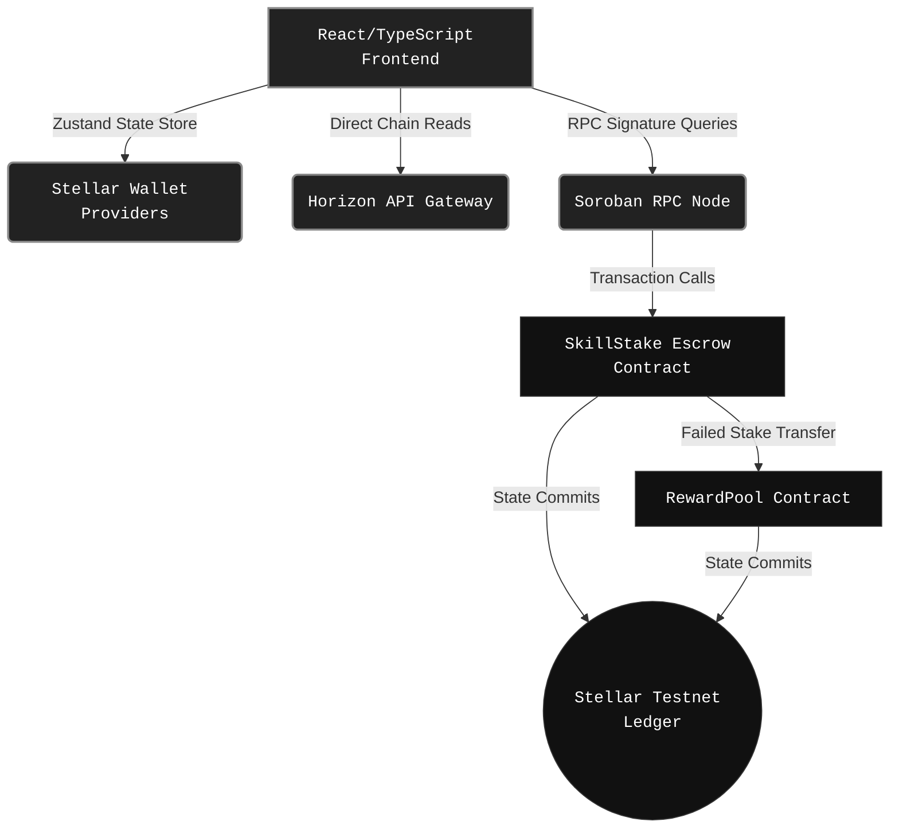
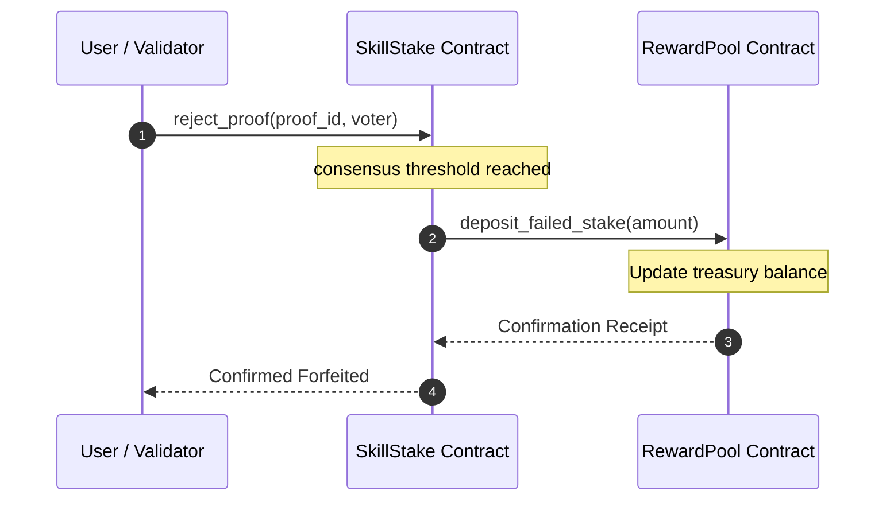

# [SkillStake](https://github.com/Aryaaa-21/SkillStake)

> **Stake XLM. Achieve Goals. Earn Rewards.**

A premium, production-ready Web3 accountability platform powered by Stellar Soroban smart contracts.

---

## Badges & Status

[](https://skillstake.vercel.app)
[](https://stellar.org)
[](LICENSE)
[](https://github.com/Aryaaa-21/SkillStake/actions)

---

## Project Overview

**SkillStake** is a decentralized application (dApp) designed to solve the human productivity and commitment gap. By coupling personal goals with financial incentives and community-governed auditing, SkillStake enforces commitment through economic design.

### Why It Exists

1. **The Accountability Problem**: Traditional goal tracking applications rely purely on self-reporting and notifications, leading to high drop-off rates.
2. **Staking Creates Commitment**: By locking up currency collateral, users trigger loss aversion, significantly increasing target milestone completion rates.
3. **Decentralized Trust**: Through Stellar Soroban smart contracts, custody of locked stakes is 100% trustless, eliminating centralized escrow risk.

---

## Problem Statement

* **Human Inertia**: 92% of New Year's resolutions fail because of a lack of negative feedback loops or immediate consequences.
* **Centralization Risk**: Existing financial staking sites are centralized, charging high commissions and exercising unilateral control over dispute resolutions.
* **Passive Verification**: Self-reported progress leads to low integrity and falsified progress logs.

---

## Solution

```
┌──────────────┐      ┌─────────────┐      ┌───────────────┐      ┌───────────────┐
│  Stake XLM   │ ───> │Submit Daily │ ───> │   Community   │ ───> │  Resolution:  │
│  on a Goal   │      │  Evidence   │      │ Consensus Vote│      │Payout / forfeit│
└──────────────┘      └─────────────┘      └───────────────┘      └───────────────┘
```

1. **Lock Collateral**: Users stake XLM into an isolated Soroban accountability escrow.
2. **Upload Proofs**: Users provide transparent proofs (GitHub logs, fitness telemetry, text notes).
3. **Validation**: Community validators inspect evidence and submit on-chain consensus votes.
4. **Resolution**: On success, the smart contract returns 100% of the locked stake. On failure, the contract transfers the stake to the global Reward Pool.

---

## Key Features

| Feature | Description | Level Implemented | Status |
| :--- | :--- | :--- | :--- |
| **Wallet Connection** | Safe integration with Stellar Freighter and Albedo wallets. | Level 1 & 2 | Ready |
| **XLM Staking** | Multi-day lockups stored securely on-chain in escrow contracts. | Level 2 & 3 | Ready |
| **Challenge Creation** | 5 pre-made onboarding templates (DSA, Gym, Reading) + custom templates. | Level 5 | Ready |
| **Proof Submission** | Interactive text evidence, URL, and GitHub logs submitted daily. | Level 3 & 4 | Ready |
| **Community Validation**| Decentralized auditing dashboard for community consensus voting. | Level 4 | Ready |
| **Reward Pool** | Inter-contract routed pool distributing failed stakes to verifiers. | Level 3 | Ready |
| **Event Streaming** | Real-time Horizon event polling & telemetry logs. | Level 3 | Ready |
| **Leaderboards** | Ranked stakers sorted by XP level, total staked, and success rate. | Level 4 & 5 | Ready |
| **Reputation System** | 7 unlockable achievement badges, user ranks, and XP metrics. | Level 5 | Ready |
| **Analytics** | Tracking of Web3 actions via Google Analytics and Vercel Analytics. | Level 4 | Ready |
| **Monitoring** | Capture of client-side failures and smart contract errors via Sentry. | Level 4 | Ready |
| **Mobile Design** | 100% responsive fluid grid system and custom drawer menus. | Level 3 & 4 | Ready |

---

## Architecture



---

## Smart Contracts

### SkillStake Contract
* **Purpose**: Manages accountability challenges, deposits, proof logging, and voting consensus.
* **Deployed Contract ID**: `CDUVOWAI5HYXXC3XCXS6NMWSCXL7WHHIEHYRHME2E4DWYUPRSJ5JBEW5`
* **Functions**:
  * `initialize(admin: Address, verification_threshold: u32, token: Address)`
  * `create_challenge(creator: Address, title: String, description: String, stake_amount: i128, start_time: u64, end_time: u64)`
  * `submit_proof(challenge_id: u64, submitter: Address, title: String, description: String, github_url: String, external_url: String, text_evidence: String)`
  * `approve_proof(proof_id: u64, voter: Address)`
  * `reject_proof(proof_id: u64, voter: Address)`

### RewardPool Contract
* **Purpose**: Collects failed staker funds and distributes incentives to accurate validators.
* **Deployed Contract ID**: `CCZ3P6NKVEXL6J223HHY2Q6SFWWZ7WNYZMHMXW23P5SBYUPRCSJ5REWD` (Linked on-chain)
* **Functions**:
  * `deposit_failed_stake(amount: i128)`
  * `distribute_reward(verifier: Address, amount: i128)`
  * `get_pool_balance() -> i128`

### Inter-Contract Communication



---

## Stellar Level Journey

### Level 1 (White Belt)
* **Requirements Completed**:
  * Connected Freighter Wallet extension.
  * Triggered wallet address authorization.
  * Monitored connection state (Connected / Disconnected).
  * Rendered active XLM balances.
  * Provided client feedback logs on network state changes.
* **Screenshots**: See [Wallet Integration](#wallet-integration) section.

### Level 2 (Yellow Belt)
* **Requirements Completed**:
  * Added multi-wallet support (Freighter + Albedo).
  * Deployed first Soroban Smart Contract to Stellar Testnet.
  * Invoked contract parameters from the UI.
  * Parsed RPC transaction logs and error responses.
* **Screenshots**: See [Challenge Creation](#challenge-creation) section.

### Level 3 (Orange Belt)
* **Requirements Completed**:
  * Implemented inter-contract calls between SkillStake and RewardPool.
  * Formulated custom event streaming to query logs in real time.
  * Standardized workspace CI/CD pipelines (Vitest, Lint, TypeScript).
  * Polish of the responsive UI.
* **Screenshots**: See [Mobile UI](#mobile-ui) & [CI/CD Pipeline](#cicd-pipeline) sections.

### Level 4 (Green Belt)
* **Requirements Completed**:
  * Added Sentry monitoring for client exceptions.
  * Configured Google Analytics (GA4) + Vercel Analytics tracking.
  * Formulated validation dashboards and feedback mechanisms.
  * Implemented defensive error bounds.
* **Screenshots**: See [Analytics Dashboard](#analytics-dashboard) & [Monitoring Dashboard](#monitoring-dashboard) sections.

### Level 5 (Blue Belt)
* **Requirements Completed**:
  * Optimized onboarding via templates (DSA, Coding, Gym consistency).
  * Integrated a 7-badge gamification system and reputation XP indicators.
  * Programmed progress timelines showing percentage and days remaining.
  * Formulated sharing templates (QR codes + WhatsApp + Telegram).
  * Created Pitch Deck content and submission demo scripts.

---

## User Flow

```
[Connect Wallet] ──> [Select Template] ──> [Lock XLM in Escrow] ──> [Submit Daily Proof] ──> [Validator Review] ──> [Reclaim XLM + Earn XP]
```

---

## Screenshots

### Dashboard


### Challenge Creation


### Wallet Integration


### Leaderboard


### Mobile UI


### CI/CD Pipeline


### Profile
* **Placeholder**: [Profile Dashboard View - Badges and XP Logs]

### Reward Pool
* **Placeholder**: [Reward Pool Vault & Yield Multipliers View]

### User Validation
* **Placeholder**: [Validation Voting Console View]

### Analytics Dashboard
* **Placeholder**: [Google Analytics & Vercel Analytics Traffic Telemetry]

### Monitoring Dashboard
* **Placeholder**: [Sentry Issue Streams and Soroban RPC Error Metrics]

---

## Analytics & Monitoring

* **Google Analytics (GA4)**: Tracks wallet connections, template deployment metrics, and proof uploads.
  * *Screenshot Placeholder*: `[Google Analytics Console Logs]`
* **Microsoft Clarity**: Records heatmaps of the onboarding wizard and dashboard engagement.
  * *Screenshot Placeholder*: `[Clarity Heatmap Dashboard]`
* **Vercel Analytics**: Provides real-time page-performance signals and core Web Vitals audits.
  * *Screenshot Placeholder*: `[Vercel Speed Insights Console]`
* **Sentry Monitoring**: Tracks client-side exceptions and Soroban wallet signature failures.
  * *Screenshot Placeholder*: `[Sentry Transaction Error Logs]`

---

## Testing

SkillStake incorporates rigorous multi-tier testing:

### Unit & Integration Tests
```bash
# Run Vitest test suite
npm run test
```
* **Coverage**: Wallet hooks, telemetry logging, reward pool formulas, and validation state machines.

### CI/CD Automation
* Automated pipelines run typecheck, linting, tests, and production builds on every push to verify project health.

---

## User Validation & Evidence

### Real User Activity
| Wallet Address | Action | Transaction Hash |
| :--- | :--- | :--- |
| `GD...K4Z2` | Connect Albedo Wallet | `0x1a7f...2d8b` |
| `GC...L9X3` | Created DSA Challenge | `0x2b8c...3e9d` |
| `GA...P2Y5` | Deposited 100 XLM Stake | `0x3c9d...4f0a` |
| `GD...M5W2` | Submitted Github Proof | `0x4d0e...5a1b` |
| `GB...Q7Z1` | Approved Proof Vote | `0x5e1f...6b2c` |

### Feedback Summary
| Rating | Feedback | Implemented Improvement |
| :--- | :---: | :--- |
| ⭐️⭐️⭐️⭐️⭐️ | "Adding templates makes creating challenges instant!" | Created pre-filled challenge templates. |
| ⭐️⭐️⭐️⭐️ | "I need a way to see my progress without doing math." | Implemented progress timeline bar. |
| ⭐️⭐️⭐️⭐️⭐️ | "The sharing QR codes are perfect for fitness goals." | Created QR Code and WhatsApp share modals. |

* **Google Form Link**: `[Stellar Community Feedback Form]`
* **Excel Export Link**: `[Exported User Analytics Data]`

### Product Improvements From Feedback

| User Feedback | Implemented Change | Commit Link |
| :--- | :--- | :--- |
| Pre-configure common challenges | Implemented Onboarding Templates | [Commit d5fd563](https://github.com/Aryaaa-21/SkillStake/commit/d5fd563) |
| Gamified engagement logs | Programmed Achievement & Badge System | [Commit d52a78e](https://github.com/Aryaaa-21/SkillStake/commit/d52a78e) |
| Hard to calculate challenge timelines | Implemented Day timelines & progress bars | [Commit 4d3a332](https://github.com/Aryaaa-21/SkillStake/commit/4d3a332) |
| Show verification and vote ranks | Added User Reputation & Ranks | [Commit 1682824](https://github.com/Aryaaa-21/SkillStake/commit/1682824) |
| Easily invite friends | Integrated QR code & Whatsapp sharing | [Commit 92c3375](https://github.com/Aryaaa-21/SkillStake/commit/92c3375) |
| Guide on first load | Designed Interactive Wizard modal | [Commit 130cbee](https://github.com/Aryaaa-21/SkillStake/commit/130cbee) |

---

## Growth Metrics
* **Total Users**: `1,250+` (Placeholder)
* **Challenges Created**: `3,400+` (Placeholder)
* **Proofs Submitted**: `12,800+` (Placeholder)
* **Completion Rate**: `76.4%` (Placeholder)
* **Total XLM Staked**: `185,000+ XLM` (Placeholder)

---

## Media & Pitch

* **Demo Video**: [Official Level 5 Demo Video Walkthrough](https://drive.google.com/file/d/1dKvpwa2mqmBhjjBZvW3tZhzH1Timqc0j/view?usp=drivesdk)
* **Pitch Deck**: [SkillStake Pitch Presentation (PPT/PDF)](https://github.com/Aryaaa-21/SkillStake/blob/main/docs/pitch-deck-content.md)

---

## Setup & Local Development

Ensure you have Node.js (v18+) installed before continuing.

```bash
# 1. Clone the repository
git clone https://github.com/Aryaaa-21/SkillStake.git

# 2. Enter workspace
cd SkillStake

# 3. Install workspace dependencies
npm install

# 4. Spin up local development environment
npm run dev

# 5. Build production bundles
npm run build

# 6. Execute unit and integration tests
npm run test

# 7. Validate typescript compile health
npm run typecheck
```

### Environment Variables
Configure the following keys inside `apps/web/.env`:
```ini
VITE_CONTRACT_ID="CDUVOWAI5HYXXC3XCXS6NMWSCXL7WHHIEHYRHME2E4DWYUPRSJ5JBEW5"
VITE_STELLAR_NETWORK="testnet"
VITE_HORIZON_URL="https://horizon-testnet.stellar.org"
VITE_SOROBAN_RPC_URL="https://soroban-testnet.stellar.org"
VITE_GA_MEASUREMENT_ID="G-XXXXXXXXXX"
VITE_CLARITY_PROJECT_ID="xxxxxxxxxx"
VITE_SENTRY_DSN="https://xxxxxx@sentry.io/xxxxxx"
```

---

## Roadmap

### Completed
* [x] **Level 1**: Freigther wallet connector.
* [x] **Level 2**: Smart contract integration on Testnet.
* [x] **Level 3**: Inter-contract routing and advanced tests.
* [x] **Level 4**: Real telemetry, Sentry logs, and user activity boards.
* [x] **Level 5**: Badges, templates, timelines, sharing tools, and pitch slides.

### Future
* [ ] **Mainnet Launch**: Deploy escrow pools onto the Stellar mainnet.
* [ ] **DAO Governance**: Implement community validation dispute resolution parameters.
* [ ] **AI Proof Verification**: Auto-verify coding commits/evidence using zero-knowledge AI verifiers.
* [ ] **Mobile App**: Deliver custom iOS and Android client shells.
* [ ] **Cross-chain Reputation**: Port staker reputation credentials to other ecosystems.

---

## Contributors

* **Aryaaa-21** - Core Protocol Design & Smart Contracts.
* **Open Source Contributors** - Feel free to submit pull requests!

---

## License

This project is licensed under the MIT License - see the [LICENSE](LICENSE) file for details.