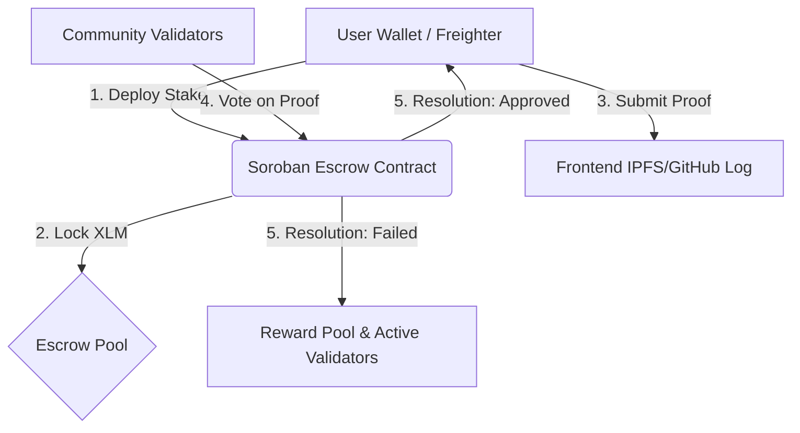

# SkillStake Pitch Deck: Decentralized Accountability Protocol

> **Slogan:** Stake XLM on your goals, verify progress through community consensus, and earn reputation multipliers on Stellar.

---

## Slide 1: Cover Slide
* **Title:** SkillStake
* **Subtitle:** Web3 Accountability & Milestone Escrows Powered by Stellar Soroban
* **Presenter:** The SkillStake Core Team
* **Contact:** team@skillstake.io | [GitHub Repository](https://github.com/Aryaaa-21/SkillStake)
* **Visual:** Sleek dark-mode mockup of a dashboard displaying locked XLM stakes, streak bars, and validator status badges.

---

## Slide 2: The Problem
* **The Productivity Gap:** Millions of users fail to complete online courses, fitness routines, and skill milestones due to a lack of tangible consequences.
* **Lack of Trust in Centralized Apps:** Current habit trackers rely on self-reporting with zero financial stakes, or utilize centralized escrows with high fees and non-transparent dispute resolutions.
* **Stale Accountability:** Users lack tokenized rewards or reputation ranks that can translate their self-discipline into verifiable on-chain capital.

---

## Slide 3: The Solution
* **Financial Incentives via Escrows:** Users lock up XLM stakes into audited, decentralized Soroban smart contracts. Achieve the goal, get your money back; fail, and it's collected.
* **Community-Audited Consensus:** Instead of self-reporting, progress is verified by active community validators submitting cryptographic proofs.
* **Reputation-as-a-Service:** Earn XP, Rank multipliers (Bronze to Diamond), and reputation badges that prove your consistency to third parties (e.g., employers, DAOs).

---

## Slide 4: Value Proposition
* **For Stakers:** High-commitment habit reinforcement. Your financial collateral guarantees focus while earning XP and success-rate multipliers.
* **For Validators:** Earn a portion of failed stakes from the global Reward Pool by casting accurate approval/rejection votes on submitted proofs.
* **For Ecosystem:** Promotes utility and volume of XLM through lockups, while proving real-world consumer utility for Stellar's smart contract layer.

---

## Slide 5: Stellar Soroban Integration Architecture

* **Decentralized Escrows:** Custom Soroban contracts holding XLM deposits, exposing public entrypoints for `deposit_stake`, `submit_proof`, `vote`, and `distribute_reward`.
* **Inter-Contract Communication:** The main Challenge contract interacts directly with the Reward Pool contract to distribute funds seamlessly.
* **Wallet Security:** Integrated with Albedo and Freighter wallets to sign transactions securely.

---

## Slide 6: Market Opportunity
* **Global EdTech & Professional Training:** Valued at $340B+ by 2026. Accountability and completion rates are the primary drop-off factors (MOOCs have <10% completion rates).
* **Corporate Wellness & Habits:** Over $60B spent annually. SkillStake offers a verifiable accountability framework for corporate upskilling.
* **Web3 Reputation:** A growing demand for on-chain resume logs. SkillStake provides a verifiable ledger of completed stakes that acts as a decentralized proof-of-capability.

---

## Slide 7: Tokenomics & Incentive Design
* **Reputation Multipliers:** As stakers build their Success Rate and level up, they unlock higher XP multipliers and access premium higher-stake tiers.
* **Staking Pools:** Stakers deposit XLM into active pools. If a user fails their challenge, their stake enters the global Reward Pool.
* **Validator Yield:** Active validators who vote correctly receive fractional XLM distributions from the Reward Pool, aligning economic incentives to verify proofs honestly.

---

## Slide 8: Product Roadmap
* **Q3 2026:** Launch on Stellar Testnet, introduce rapid-onboarding templates, telemetry, and quick-start wizard (Current Milestone).
* **Q4 2026:** Mainnet launch, mobile app release, and integration with GitHub API for automated developer proof validation.
* **Q1 2027:** DAO governance launch, custom reward token distribution, and integration with third-party fitness APIs (e.g., Strava).

---

## Slide 9: Financial Targets
* **Year 1 Target:** $500K Total Value Locked (TVL) in accountability escrows.
* **Validator Growth:** 5,000+ active consensus validators globally.
* **Revenue Model:** A minor 2% fee collected on successful escrow withdrawals to fund protocol maintenance and future feature development.

---

## Slide 10: Conclusion
* **Call to Action:** Experience decentralized accountability today.
* **Live App:** [SkillStake Production](https://skillstake.vercel.app)
* **Get Involved:** Join our developer channel on Discord and begin staking!
